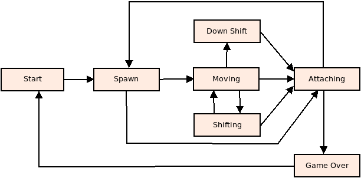

# Инструкция по игре Тетрис

### Введение

Тетрис это классическая головоломка, где вам нужно управлять падающими блоками различной формы, чтобы заполнить горизонтальные линии на игровом поле без пробелов. Когда линия полностью заполняется, она исчезает, освобождая место для новых блоков.

### Управление

Управляйте падением блоков, перемещая их влево и вправо и вращая их, чтобы они подходили друг к другу. Основные команды управления:

`Стрелки влево/вправо` — перемещают текущий блок влево или вправо соответственно.

`Стрелка вниз` — ускоряет падение блока.

`Пробел` — вращает блок вокруг его центра.

`p` — пауза.

`esc `— завершение игры.

### Цель игры

Цель игры - набрать как можно больше очков, заполняя целые линии на игровом поле. Чем больше линий вы заполняете за один раз, тем больше очков вы получите. Будьте внимательны, чтобы не заполнить вершину игрового поля, иначе игра закончится.

### Сложность игры

С течением времени скорость падения блоков увеличивается, делая игру сложнее. Постарайтесь сохранять спокойствие и сосредоточенность, чтобы продолжать набирать очки.

### Рекорды

Попробуйте установить новый рекорд, набирая как можно больше очков. Рекорды сохраняются между играми, так что вы всегда можете попытаться превзойти свой лучший результат.

# Конечный автомат

